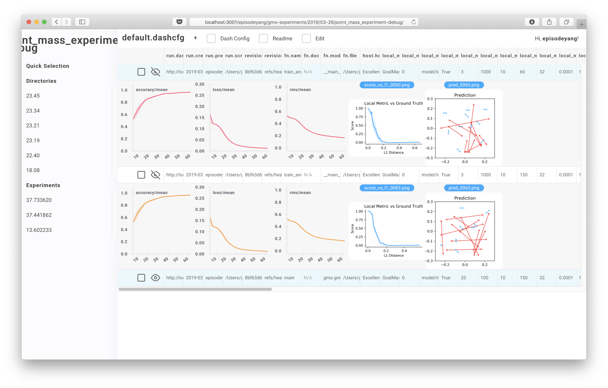

# ML-Dash, A Beautiful Visualization Dashboard for Machine Learning

[](http://pepy.tech/project/ml-dash)



ML-dash replaces visdom and tensorboard. It allows you to see real-time updates, review 1000+ of experiments quickly, and dive in-depth into indivisual experiments with minimum mental effort.

- **Parallel Coordinates**
- **Aggregating Over Multiple Runs (with differetn seeds)**
- **Preview Videos, figures, and images.**

## Usage

To make sure you **install** the newest version of `ml_dash`:
```bash
pip install ml-dash --upgrade --no-cache
```

There are two servers: 

1. a server that serves the static web-application files `ml_dash.app`

    This is just a static server that serves the web application client.
    
    To run this:
    
    ```bash
    python -m ml_dash.app
    ```
    
2. the visualization backend `ml_dash.server`

    This server usually lives on your logging server. It offers a `graphQL`
    API backend for the dashboard client.

    ```bash
    python -m ml_dash.server
    ```
    
    **Note: the server accepts requests from `localhost` only by default
     for safety reasons.**


### Implementation Notes

See [./notes/README.md](./notes/README.md)
