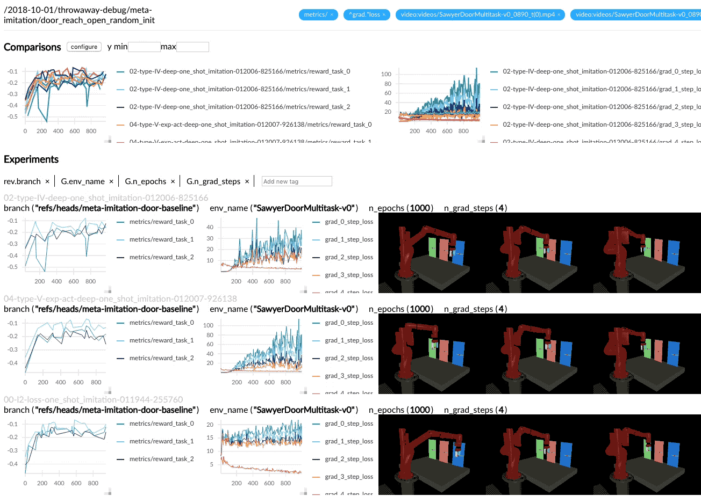

# ML-Dash, A Beautiful Visualization Dashboard for Machine Learning

[](http://pepy.tech/project/ml-dash)



ML-Dash goes beyond what you can visualize for a single experiment using tensorboard. ML-Dash is the 

- save data locally and remotely, as **binary**, in a transparent `pickle` file, with the same API and zero 
configuration.
- write from 500+ worker containers to a single instrumentation server
- visualize `matplotlib.pyplot` figures from a remote server locally with `logger.savefig('my_figure.png')`

And ml-dash does all of these with *minimal configuration* — you can use the same logging 
code both locally and remotely with no code change.

ML-logger is highly performant -- the remote writes are asynchronous. For this reason it doesn't slow down your training
even with 100+ metric keys.

Why did we built this, you might ask? Because we want to make it easy for people in ML to 
use the same logging code in all of they projects, so that it is easy to get started with 
someone else's baseline.


## Usage

To **install** `ml_dash`, do:
```bash
pip install ml-dash
```

**Skip this if you just want to log locally.** To kickstart a logging server (Instrument Server), run
```bash
python -m ml_dash.server
```
It is the easiest if you setup a long-lived instrument server with a public ip for yourself or the entire lab.

